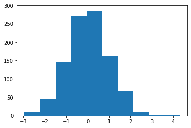
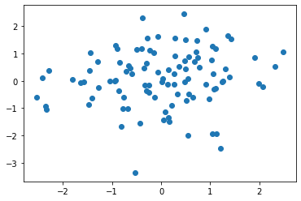
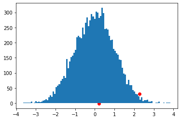
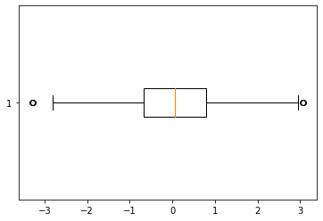
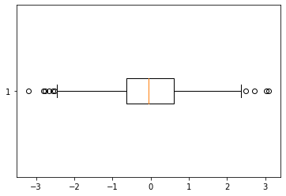
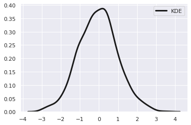
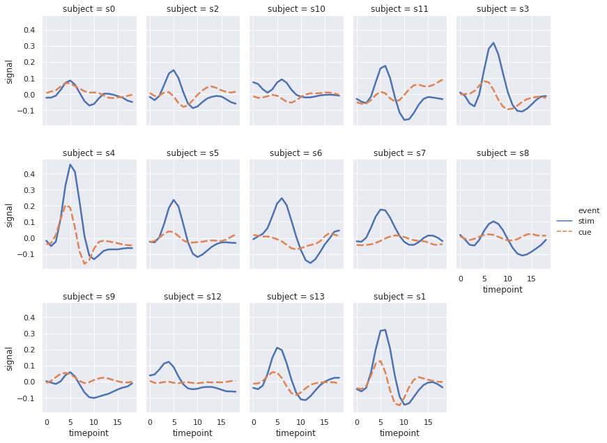
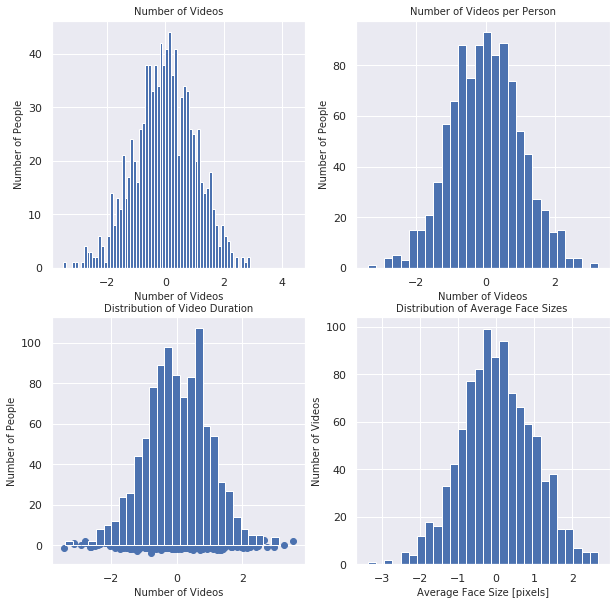

```python
%load_ext autoreload
%autoreload 2
from plotlib.main import plot, snsplot, plt, sns
import numpy as np

```

    The autoreload extension is already loaded. To reload it, use:
      %reload_ext autoreload


## Call any sns/matplotlib plot throught the `plot` function
Use the function itself as a kwarg with the parameters to be plotted as a tuple


```python
plot(hist=np.random.randn(1000)); plt.show()
plot(scatter=(np.random.randn(100), np.random.randn(100)))
```





    <matplotlib.collections.PathCollection at 0x7efdeda24190>





### Combine Plots


```python
plot(imshow=np.random.randn(500,500)*255,
     scatter=(np.random.randn(100)*100, np.random.randn(100)*100))
```


    <matplotlib.collections.PathCollection at 0x7efde98b0950>


### Use kwargs for more control


```python
plot(hist={'x': np.random.randn(10000), 'bins': 100},
     scatter={'x': np.random.randn(80), 'y': 40+10*np.arange(-4, 4, step=0.1)+np.random.randn(80), 'c': 'red'},); plt.show()

plot(boxplot={'x': np.random.randn(1000), 'vert': False});
```











### Same style for sns plotting as well


```python
snsplot(set={'style':"darkgrid"})
```


```python
snsplot(distplot={'a': np.random.randn(1000), 'hist': False, 'kde_kws':{"color": "k", "lw": 3, "label": "KDE"}})
```


    <matplotlib.axes._subplots.AxesSubplot at 0x7efde75b12d0>





```python
%%time
fmri = sns.load_dataset("fmri")
snsplot(relplot={'x':"timepoint", 'y':"signal", 'hue':"event", 'style':"event",
            'col':"subject", 'col_wrap':5,
            'height':3, 'aspect':.75, 'linewidth':2.5,
            'kind':"line", 'data':fmri.query("region == 'frontal'")})
```

    CPU times: user 2.07 s, sys: 3.35 ms, total: 2.07 s
    Wall time: 2.07 s


    <seaborn.axisgrid.FacetGrid at 0x7efde975aa10>





### Easy for automatic plots
* `i` is reserved for axis. 


```python
fig, ax = plot(close='all', subplots=(2, 2, {'figsize': (10,10)}))
ax = iter(ax.flat)
font = {'fontsize':10}

plot(
    i=next(ax),
    set_title=('Number of Videos', font),
    set_xlabel=('Number of Videos', font),
    set_ylabel=('Number of People', font),
    hist=({'x': np.random.randn(1000), 'bins': 0.5+np.arange(-4, 4, 0.1)})
)

plot(
    i=next(ax),
    set_title=('Number of Videos per Person', font),
    set_xlabel=('Number of Videos', font),
    set_ylabel=('Number of People', font),
    hist=({'x': np.random.randn(1000), 'bins': 28})
)

plot(
    i=next(ax),
    scatter=({'x': np.random.randn(1000), 'y': np.random.randn(1000)}),
    set_title=('Distribution of Video Duration', font),
    set_xlabel=('Number of Videos', font),
    set_ylabel=('Number of People', font),
    hist=({'x': np.random.randn(1000), 'bins': 28})
)

plot(
    i=next(ax),
    hist = (np.random.randn(1000), {'bins':28}),
    set_title = ('Distribution of Average Face Sizes ',font),
    **{k:v for k,v in zip(['set_xlabel','set_ylabel'], 
                          [(v,{'fontsize': 10}) for v in 
                           ['Average Face Size [pixels]','Number of Videos']])}
); 
```




